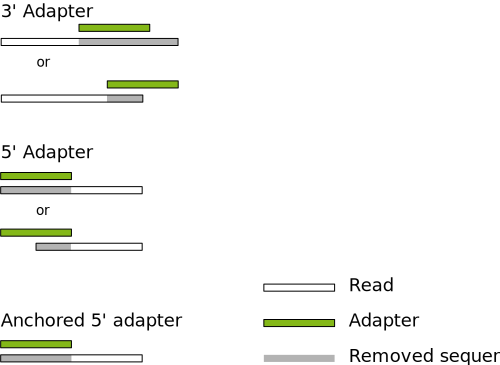

==========
User guide
==========

Basic usage
===========

To trim a 3' adapter, the basic command-line for cutadapt is::

    cutadapt -a AACCGGTT -o output.fastq input.fastq

The sequence of the adapter is given with the ``-a`` option. You need to replace
``AACCGGTT`` with your actual adapter sequence. Reads are read from the input
file ``input.fastq`` and written to the output file ``output.fastq``.

Cutadapt searches for the adapter in all reads and removes it when it finds it.
All reads that were present in the input file will also be present in the output
file, some of them trimmed, some of them not. Even reads that were trimmed
entirely (because the adapter was found in the very beginning) are output. All
of this can be changed with command-line options, explained further down.

Input and output file formats
-----------------------------

Input files for cutadapt need to be in one the these formats:

* FASTA (file name extensions: ``.fasta``, ``.fa``, ``.fna``)
* FASTQ (extensions: ``.fastq``, ``.fq``)
* Any of the above, but compressed as ``.gz`` (even ``.bz2`` and ``.xz`` are supported).

:ref:`Cutadapt’s support for processing of colorspace data is described
elsewhere <colorspace>`.

Input and output file formats are recognized from the file name extension. You
can override the input format with the ``--format`` option.

You can even use this -- without any adapter trimming -- to convert from
FASTQ to FASTA::

    cutadapt -o output.fasta input.fastq.gz

Compressed files
----------------

Cutadapt supports compressed input and output files. Whether an input file
needs to be decompressed or an output file needs to be compressed is detected
automatically by inspecting the file name: If it ends in ``.gz``, then gzip
compression is assumed. You can therefore run cutadapt like this and it works
as expected::

    cutadapt -a AACCGGTT -o output.fastq.gz input.fastq.gz

All of cutadapt's options that expect a file name support this.

Files compressed with bzip2 (``.bz2``) or xz (``.xz``) are also supported, but
only if the Python installation includes the proper modules. xz files require
Python 3.3 or later.

Concatenated bz2 files are *not supported* on Python versions before 3.3.
These files are created by utilities such as ``pbzip2`` (parallel bzip2).

Concatenated gz files *are* supported on all supported Python versions.

Standard input and output
-------------------------

If no output file is specified via the ``-o`` option, then the output is sent to
the standard output stream. Instead of the example command line from above, you
can therefore also write::

    cutadapt -a AACCGGTT input.fastq > output.fastq

There is one difference in behavior if you use cutadapt without ``-o``: The
report is sent to the standard error stream instead of standard output. You
can redirect it to a file like this::

    cutadapt -a AACCGGTT input.fastq > output.fastq 2> report.txt

Wherever cutadapt expects a file name, you can also write a dash (``-``) in
order to specify that standard input or output should be used. For example::

    tail -n 4 input.fastq | cutadapt -a AACCGGTT - > output.fastq

The ``tail -n 4`` prints out only the last four lines of ``input.fastq``, which
are then piped into cutadapt. Thus, cutadapt will work only on the last read in
the input file.

In most cases, you should probably use ``-`` at most once for an input file and
at most once for an output file, in order not to get mixed output.

You cannot combine ``-`` and gzip compression since cutadapt needs to know the
file name of the output or input file. if you want to have a gzip-compressed
output file, use ``-o`` with an explicit name.

One last "trick" is to use ``/dev/null`` as an output file name. This special
file discards everything you send into it. If you only want to see the
statistics output, for example, and do not care about the trimmed reads at all,
you could use something like this::

    cutadapt -a AACCGGTT -o /dev/null input.fastq

Read processing
===============

Cutadapt can do a lot more in addition to removing adapters. There are various
command-line options that make it possible to modify and filter reads and to
redirect them to various output files. Each read is processed in the following
way:

1. :ref:`Read modification options <modifying-reads>` are applied. This includes
   :ref:`adapter removal <removing-adapters>`,
   :ref:`quality trimming <quality-trimming>`, read name modifications etc. The
   order in which they are applied is the order in which they are listed in the
   help shown by ``cutadapt --help`` under the “Additional read modifications”
   heading. Adapter trimming itself does not appear in that list and is
   done after quality trimming and before length trimming (``--length``/``-l``).

2. :ref:`Filtering options <filtering>` are applied, such as removal of too
   short or untrimmed reads. Some of the filters also allow to redirect a read
   to a separate output file.  The filters are applied in the order in which
   they are listed in the help shown by ``cutadapt --help`` under the
   “Filtering of processed reads” heading.
3. If the read has passed all the filters, it is written to the output file.

.. _removing-adapters:

Removing adapters
=================

Cutadapt supports trimming of multiple types of adapters:

=================================================== ===========================
Adapter type                                        Command-line option
=================================================== ===========================
:ref:`3' adapter <three-prime-adapters>`            ``-a ADAPTER``
:ref:`5' adapter <five-prime-adapters>`             ``-g ADAPTER``
:ref:`Anchored 3' adapter <anchored-3adapters>`     ``-a ADAPTER$``
:ref:`Anchored 5' adapter <anchored-5adapters>`     ``-g ^ADAPTER``
:ref:`5' or 3' (both possible) <anywhere-adapters>` ``-b ADAPTER``
:ref:`Linked adapter <linked-adapters>`             ``-a ADAPTER1...ADAPTER2``
=================================================== ===========================

Here is an illustration of the allowed adapter locations relative to the read
and depending on the adapter type:

|

|

By default, all adapters :ref:`are searched error-tolerantly <error-tolerance>`.
Adapter sequences :ref:`may also contain any IUPAC wildcard
character <wildcards>` (such as ``N``).

In addition, it is possible to :ref:`remove a fixed number of
bases <cut-bases>` from the beginning or end of each read, and to :ref:`remove
low-quality bases (quality trimming) <quality-trimming>` from the 3' and 5' ends.

.. _three-prime-adapters:

3' adapters
-----------

A 3' adapter is a piece of DNA ligated to the 3' end of the DNA fragment you
are interested in. The sequencer starts the sequencing process at the 5' end of
the fragment and sequences into the adapter if the read is long enough.
The read that it outputs will then have a part of the adapter in the
end. Or, if the adapter was short and the read length quite long, then the
adapter will be somewhere within the read (followed by other bases).

For example, assume your fragment of interest is *MYSEQUENCE* and the adapter is
*ADAPTER*. Depending on the read length, you will get reads that look like this::

    MYSEQUEN
    MYSEQUENCEADAP
    MYSEQUENCEADAPTER
    MYSEQUENCEADAPTERSOMETHINGELSE

Use cutadapt's ``-a ADAPTER`` option to remove this type of adapter. This will
be the result::

    MYSEQUEN
    MYSEQUENCE
    MYSEQUENCE
    MYSEQUENCE

As can be seen, cutadapt correctly deals with partial adapter matches, and also
with any trailing sequences after the adapter. Cutadapt deals with 3' adapters
by removing the adapter itself and any sequence that may follow. If the sequence
starts with an adapter, like this::

    ADAPTERSOMETHING

Then the sequence will be empty after trimming. By default, empty reads are kept
and will appear in the output.

.. _five-prime-adapters:

5' adapters
-----------

.. note::
    Unless your adapter may also occur in a degraded form, you probably
    want to use an anchored 5' adapter, described in the next section.

A 5' adapter is a piece of DNA ligated to the 5' end of the DNA fragment of
interest. The adapter sequence is expected to appear at the start of the read,
but may be partially degraded. The sequence may also appear somewhere within
the read. In all cases, the adapter itself and the sequence preceding it is
removed.

Again, assume your fragment of interest is *MYSEQUENCE* and the adapter is
*ADAPTER*. The reads may look like this::

    ADAPTERMYSEQUENCE
    DAPTERMYSEQUENCE
    TERMYSEQUENCE
    SOMETHINGADAPTERMYSEQUENCE

All the above sequences are trimmed to ``MYSEQUENCE`` when you use `-g ADAPTER`.
As with 3' adapters, the resulting read may have a length of zero when the
sequence ends with the adapter. For example, the read ::

    SOMETHINGADAPTER

will be empty after trimming.

.. _anchored-5adapters:

Anchored 5' adapters
--------------------

In many cases, the above behavior is not really what you want for trimming 5'
adapters. You may know, for example, that degradation does not occur and that
the adapter is also not expected to be within the read. Thus, you always expect
the read to look like the first example from above::

    ADAPTERSOMETHING

If you want to trim only this type of adapter, use ``-g ^ADAPTER``. The ``^`` is
supposed to indicate the the adapter is "anchored" at the beginning of the read.
In other words: The adapter is expected to be a prefix of the read. Note that
cases like these are also recognized::

    ADAPTER
    ADAPT
    ADA

The read will simply be empty after trimming.

Be aware that cutadapt still searches for adapters error-tolerantly and, in
particular, allows insertions. So if your maximum error rate is sufficiently
high, even this read will be trimmed::

    BADAPTERSOMETHING

The ``B`` in the beginning is seen as an insertion. If you also want to prevent
this from happening, use the option ``--no-indels`` to disallow insertions and
deletions entirely.

.. _anchored-3adapters:

Anchored 3' adapters
--------------------

It is also possible to anchor 3' adapters to the end of the read. This is
rarely necessary, but if you have merged, for example, overlapping paired-end
reads, then it is useful. Add the ``$`` character to the end of an
adapter sequence specified via ``-a`` in order to anchor the adapter to the
end of the read, such as ``-a ADAPTER$``. The adapter will only be found if it
is a *suffix* of the read, but errors are still allowed as for 5' adapters.
You can disable insertions and deletions with ``--no-indels``.

Anchored 3' adapters work as if you had reversed the sequence and used an
appropriate anchored 5' adapter.

As an example, assume you have these reads::

    MYSEQUENCEADAP
    MYSEQUENCEADAPTER
    MYSEQUENCEADAPTERSOMETHINGELSE

Using ``-a ADAPTER$`` will result in::

    MYSEQUENCEADAP
    MYSEQUENCE
    MYSEQUENCEADAPTERSOMETHINGELSE

That is, only the middle read is trimmed at all.

.. _linked-adapters:

Linked adapters (combined 5' and 3' adapter)
--------------------------------------------

If your sequence of interest ist “framed” by a 5' and a 3' adapter, and you want
to remove both adapters, then you may want to use a *linked adapter*. A linked
adapter combines an anchored 5' adapter and a 3' adapter. The 3' adapter can be
regular or anchored. The idea is that a read is only trimmed if the anchored
adapters occur. Thus, the 5' adapter is always required, and if the 3' adapter
was specified as anchored, it also must exist for a successful match.

:ref:`See the previous sections <anchored-5adapters>` for what anchoring means.

Use ``-a ADAPTER1...ADAPTER2`` to search for a linked adapter. ADAPTER1 is
always interpreted as an anchored 5' adapter. Here, ADAPTER2 is a
regular 3' adapter. If you write ``-a ADAPTER1...ADAPTER2$`` instead,
then the 3' adapter also becomes anchored, that is, for a read to be
trimmed, both adapters must exist at the respective ends.

Note that the ADAPTER1 is always interpreted as an anchored 5' adapter even though
there is no ``^`` character in the beginning.

In summary:

* ``-a ADAPTER1...ADAPTER2``: The 5' adapter is removed if it occurs. If a 3' adapter
  occurs, it is removed only when also a 5' adapter is present.
* ``-a ADAPTER1...ADAPTER2$``: The adapters are removed only if both occur.

As an  example, assume the 5' adapter is *FIRST* and the 3' adapter is *SECOND*
and you have these input reads::

    FIRSTMYSEQUENCESECONDEXTRABASES
    FIRSTMYSEQUENCESEC
    FIRSTMYSEQUE
    ANOTHERREADSECOND

Trimming with ::

    cutadapt -a FIRST...SECOND input.fastq > output.fastq

will result in ::

    MYSEQUENCE
    MYSEQUENCE
    MYSEQUE
    ANOTHERREADSECOND

The 3' adapter in the last read is not trimmed because the read does not contain
the 5' adapter.

This feature does not work when used in combination with some other options,
such as ``--info-file``, ``--mask-adapter``.

.. versionadded:: 1.10

.. versionadded:: 1.13
   Ability to anchor the 3' adapter.

Linked adapters without anchoring
~~~~~~~~~~~~~~~~~~~~~~~~~~~~~~~~~

Sometimes, the 5' adapter of a linked adapter pair should not be anchored. It is possible to
specify linked adapters also with ``-g ADAPTER1...ADAPTER2`` (note that ``-g`` is used instead
of ``-a``). These work just like the linked adapters described in the previous section,
*except that the 5' adapter is not anchored by default*.

This feature has been added on a tentative basis. It may change in the next program version.

.. versionadded:: 1.13

Linked adapter statistics
~~~~~~~~~~~~~~~~~~~~~~~~~

For linked adapters, the statistics report contains a line like this::

    === Adapter 1 ===

    Sequence: AAAAAAAAA...TTTTTTTTTT; Type: linked; Length: 9+10; Trimmed: 3 times; Half matches: 2

The value for “Half matches” tells you how often only the 5'-side of the adapter was found, but not
the 3'-side of it. This applies only to linked adapters with regular (non-anchored) 3' adapters.

.. _anywhere-adapters:

5' or 3' adapters
-----------------

The last type of adapter is a combination of the 5' and 3' adapter. You can use
it when your adapter is ligated to the 5' end for some reads and to the 3' end
in other reads. This probably does not happen very often, and this adapter type
was in fact originally implemented because the library preparation in an
experiment did not work as it was supposed to.

For this type of adapter, the sequence is specified with ``-b ADAPTER`` (or use
the longer spelling ``--anywhere ADAPTER``). The adapter may appear in the
beginning (even degraded), within the read, or at the end of the read (even
partially). The decision which part of the read to remove is made as follows: If
there is at least one base before the found adapter, then the adapter is
considered to be a 3' adapter and the adapter itself and everything
following it is removed. Otherwise, the adapter is considered to be a 5'
adapter and it is removed from the read, but the sequence after it remains.

Here are some examples.

============================== =================== =====================
Read before trimming           Read after trimming Detected adapter type
============================== =================== =====================
``MYSEQUENCEADAPTERSOMETHING`` ``MYSEQUENCE``      3' adapter
``MYSEQUENCEADAPTER``          ``MYSEQUENCE``      3' adapter
``MYSEQUENCEADAP``             ``MYSEQUENCE``      3' adapter
``MADAPTER``                   ``M``               3' adapter
``ADAPTERMYSEQUENCE``          ``MYSEQUENCE``      5' adapter
``PTERMYSEQUENCE``             ``MYSEQUENCE``      5' adapter
``TERMYSEQUENCE``              ``MYSEQUENCE``      5' adapter
============================== =================== =====================

The ``-b`` option cannot be used with colorspace data.

.. _error-tolerance:

Error tolerance
---------------

All searches for adapter sequences are error tolerant. Allowed errors are
mismatches, insertions and deletions. For example, if you search for the
adapter sequence ``ADAPTER`` and the error tolerance is set appropriately
(as explained below), then also ``ADABTER`` will be found (with 1 mismatch),
as well as ``ADAPTR`` (with 1 deletion), and also ``ADAPPTER`` (with 1
insertion).

The level of error tolerance is adjusted by specifying a *maximum error rate*,
which is 0.1 (=10%) by default. Use the ``-e`` option to set a different value.
To determine the number of allowed errors, the maximum error rate is multiplied
by the length of the match (and then rounded off).

What does that mean?
Assume you have a long adapter ``LONGADAPTER`` and it appears in full somewhere
within the read. The length of the match is 11 characters since the full adapter
has a length of 11, therefore 11·0.1=1.1 errors are allowed with the default
maximum error rate of 0.1. This is rounded off to 1 allowed error. So the
adapter will be found within this read::

    SEQUENCELONGADUPTERSOMETHING

If the match is a bit shorter, however, the result is different::

    SEQUENCELONGADUPT

Only 9 characters of the adapter match: ``LONGADAPT`` matches ``LONGADUPT``
with one substitution. Therefore, only 9·0.1=0.9 errors are allowed. Since this
is rounded off to zero allowed errors, the adapter will not be found.

The number of errors allowed for a given adapter match length is also shown in
the report that cutadapt prints::

    Sequence: 'LONGADAPTER'; Length: 11; Trimmed: 2 times.

    No. of allowed errors:
    0-9 bp: 0; 10-11 bp: 1

This tells us what we now already know: For match lengths of 0-9 bases, zero
errors are allowed and for matches of length 10-11 bases, one error is allowed.

The reason for this behavior is to ensure that short matches are not favored
unfairly. For example, assume the adapter has 40 bases and the maximum error
rate is 0.1, which means that four errors are allowed for full-length matches.
If four errors were allowed even for a short match such as one with 10 bases, this would
mean that the error rate for such a case is 40%, which is clearly not what was
desired.

Insertions and deletions can be disallowed by using the option
``--no-indels``.

See also the :ref:`section on details of the alignment algorithm <algorithm>`.

Multiple adapter occurrences within a single read
-------------------------------------------------

If a single read contains multiple copies of the same adapter, the basic rule is
that the leftmost match is used for both 5' and 3' adapters. For example, when
searching for a 3' adapter in ::

    cccccADAPTERgggggADAPTERttttt

the read will be trimmed to ::

    ccccc

When the adapter is a 5' adapter instead, the read will be trimmed to ::

    gggggADAPTERttttt

The above applies when both occurrences of the adapter are *exact* matches, and
it also applies when both occurrences of the adapter are *inexact* matches (that
is, it has at least one indel or mismatch). However, if one match is exact, but
the other is inexact, then the exact match wins, even if it is not the leftmost
one! The reason for this behavior is that cutadapt searches for exact matches
first and, to improve performance, skips the error-tolerant matching step if an
exact match was found.

Reducing random matches
-----------------------

Since cutadapt allows partial matches between the read and the adapter sequence,
short matches can occur by chance, leading to erroneously trimmed bases. For
example, roughly 25% of all reads end with a base that is identical to the
first base of the adapter. To reduce the number of falsely trimmed bases,
the alignment algorithm requires that at least *three bases* match between
adapter and read. The minimum overlap length can be changed with the parameter
``--overlap`` (or its short version ``-O``). Shorter matches are simply
ignored, and the bases are not trimmed.

Requiring at least three bases to match is quite conservative. Even if no
minimum overlap was required, we can compute that we lose only about 0.44 bases
per read on average, see `Section 2.3.3 in my
thesis <http://hdl.handle.net/2003/31824>`_. With the default minimum
overlap length of 3, only about 0.07 bases are lost per read.

When choosing an appropriate minimum overlap length, take into account that
true adapter matches are also lost when the overlap length is higher than
zero, reducing cutadapt's sensitivity.

.. _wildcards:

Wildcards
---------

All `IUPAC nucleotide codes <http://www.bioinformatics.org/sms/iupac.html>`_
(wildcard characters) are supported. For example, use an ``N`` in the adapter
sequence to match any nucleotide in the read, or use ``-a YACGT`` for an adapter
that matches both ``CACGT`` and ``TACGT``. The wildcard character ``N`` is
useful for trimming adapters with an embedded variable barcode::

    cutadapt -a ACGTAANNNNTTAGC -o output.fastq input.fastq

Wildcard characters in the adapter are enabled by default. Use the option ``-N``
to disable this.

Matching of wildcards in the reads is also possible, but disabled by default
in order to avoid matches in reads that consist of many (often low-quality)
``N`` bases. Use ``--match-read-wildcards`` to enable wildcards also in reads.

If wildcards are disabled entirely (that is, you use ``-N`` and *do not* use
``--match-read-wildcards``), then cutadapt compares characters by ASCII value.
Thus, both the read and adapter can be arbitrary strings (such as ``SEQUENCE``
or ``ADAPTER`` as used here in the examples).

Wildcards do not work in colorspace.

Repeated bases in the adapter sequence
--------------------------------------

If you have many repeated bases in the adapter sequence, such as many ``N`` s or
many ``A`` s, you do not have to spell them out. For example, instead of writing
ten ``A`` in a row (``AAAAAAAAAA``), write ``A{10}`` instead. The number within
the curly braces specifies how often the character that preceeds it will be
repeated. This works also for IUPAC wildcard characters, as in ``N{5}``.

It is recommended that you use quotation marks around your adapter sequence if
you use this feature. For poly-A trimming, for example, you would write::

    cutadapt -a "A{100}" -o output.fastq input.fastq

.. _modifying-reads:

Modifying reads
===============

This section describes in which ways reads can be modified other than adapter
removal.

.. _cut-bases:

Removing a fixed number of bases
--------------------------------

By using the ``--cut`` option or its abbreviation ``-u``, it is possible to
unconditionally remove bases from the beginning or end of each read. If
the given length is positive, the bases are removed from the beginning
of each read. If it is negative, the bases are removed from the end.

For example, to remove the first five bases of each read::

    cutadapt -u 5 -o trimmed.fastq reads.fastq

To remove the last seven bases of each read::

    cutadapt -u -7 -o trimmed.fastq reads.fastq

The ``-u``/``--cut`` option can be combined with the other options, but
the ``--cut`` is applied *before* any adapter trimming.

.. _quality-trimming:

Quality trimming
----------------

The ``-q`` (or ``--quality-cutoff``) parameter can be used to trim
low-quality ends from reads before adapter removal. For this to work
correctly, the quality values must be encoded as ascii(phred quality +
33). If they are encoded as ascii(phred quality + 64), you need to add
``--quality-base=64`` to the command line.

Quality trimming can be done without adapter trimming, so this will work::

    cutadapt -q 10 -o output.fastq input.fastq

By default, only the 3' end of each read is quality-trimmed. If you want to
trim the 5' end as well, use the ``-q`` option with two comma-separated cutoffs::

    cutadapt -q 15,10 -o output.fastq input.fastq

The 5' end will then be trimmed with a cutoff of 15, and the 3' end will be
trimmed with a cutoff of 10. If you only want to trim the 5' end, then use a
cutoff of 0 for the 3' end, as in ``-q 10,0``.

.. _nextseq-trim:

Quality trimming of reads using two-color chemistry (NextSeq)
~~~~~~~~~~~~~~~~~~~~~~~~~~~~~~~~~~~~~~~~~~~~~~~~~~~~~~~~~~~~~

Some Illumina instruments use a two-color chemistry to encode the four bases.
This includes the NextSeq and the (at the time of this writing) recently
announced NovaSeq. In those instruments, a 'dark cycle' (with no detected color)
encodes a ``G``. However, dark cycles also occur when when sequencing "falls
off" the end of the fragment. The read then `contains a run of high-quality, but
incorrect ``G`` calls <https://sequencing.qcfail.com/articles/illumina-2-colour-chemistry-can-overcall-high-confidence-g-bases/>`_
at its 3' end.

Since the regular quality-trimming algorithm cannot deal with this situation,
you need to use the ``--nextseq-trim`` option::

    cutadapt --nextseq-trim=20 -o out.fastq input.fastq

This works like regular quality trimming (where one would use ``-q 20``
instead), except that the qualities of ``G`` bases are ignored.

.. versionadded:: 1.10

Quality trimming algorithm
~~~~~~~~~~~~~~~~~~~~~~~~~~

The trimming algorithm is the same as the one used by BWA, but applied to both
ends of the read in turn (if requested). That is: Subtract the given cutoff
from all qualities; compute partial sums from all indices to the end of the
sequence; cut the sequence at the index at which the sum is minimal. If both
ends are to be trimmed, repeat this for the other end.

The basic idea is to remove all bases starting from the end of the read whose
quality is smaller than the given threshold. This is refined a bit by allowing
some good-quality bases among the bad-quality ones. In the following example,
we assume that the 3' end is to be quality-trimmed.

Assume you use a threshold of 10 and have these quality values:

42, 40, 26, 27, 8, 7, 11, 4, 2, 3

Subtracting the threshold gives:

32, 30, 16, 17, -2, -3, 1, -6, -8, -7

Then sum up the numbers, starting from the end (partial sums). Stop early if
the sum is greater than zero:

(70), (38), 8, -8, -25, -23, -20, -21, -15, -7

The numbers in parentheses are not computed (because 8 is greater than zero),
but shown here for completeness. The position of the minimum (-25) is used as
the trimming position. Therefore, the read is trimmed to the first four bases,
which have quality values 42, 40, 26, 27.

Shortening reads to a fixed length
----------------------------------

To shorten each read down to a certain length, use the ``--length`` option or
the short version ``-l``::

    cutadapt -l 10 input.fastq > output.fastq

This shortens all reads from ``input.fastq`` down to 10 bases. The removed bases
are those on the 3' end.

If you want to remove a fixed number of bases from each read, use
:ref:`the --cut option instead <cut-bases>`.

Modifying read names
--------------------

If you feel the need to modify the names of processed reads, some of the
following options may be useful.

Use ``-y`` or ``--suffix`` to append a text to read names. The given string can
contain the placeholder ``{name}``, which will be replaced with the name of the
adapter found in that read. For example, writing ::

    cutadapt -a adapter1=ACGT -y ' we found {name}' input.fastq

changes a read named ``read1`` to ``read1 we found adapter1`` if the adapter
``ACGT`` was found. The options ``-x``/``--prefix`` work the same, but the text
is added in front of the read name. For both options, spaces need to be
specified explicitly, as in the above example. If no adapter was found in a
read, the text ``no_adapter`` is inserted for ``{name}``.

In order to remove a suffix of each read name, use ``--strip-suffix``.

Some old 454 read files contain the length of the read in the name::

    >read1 length=17
    ACGTACGTACAAAAAAA

If you want to update this to the correct length after trimming, use the option
``--length-tag``. In this example, this would be ``--length-tag 'length='``.
After trimming, the read would perhaps look like this::

    >read1 length=10
    ACGTACGTAC

Read modification order
-----------------------

The read modifications described above are applied in the following order to
each read. Steps not requested on the command-line are skipped.

1. Unconditional base removal with ``--cut``
2. Quality trimming (``-q``)
3. Adapter trimming (``-a``, ``-b``, ``-g`` and uppercase versions)
4. Read shortening (``--length``)
5. N-end trimming (``--trim-n``)
6. Length tag modification (``--length-tag``)
7. Read name suffix removal (``--strip-suffix``)
8. Addition of prefix and suffix to read name (``-x``/``--prefix`` and ``-y``/``--suffix``)
9. Double-encode the sequence (only colorspace)
10. Replace negative quality values with zero (zero capping, only colorspace)
11. Trim primer base (only colorspace)

The last three steps are colorspace-specific.

.. _filtering:

Filtering reads
===============

By default, all processed reads, no matter whether they were trimmed are not,
are written to the output file specified by the ``-o`` option (or to standard
output if ``-o`` was not provided). For paired-end reads, the second read in a
pair is always written to the file specified by the ``-p`` option.

The options described here make it possible to filter reads by either discarding
them entirely or by redirecting them to other files. When redirecting reads,
the basic rule is that *each read is written to at most one file*. You cannot
write reads to more than one output file.

In the following, the term "processed read" refers to a read to which all
modifications have been applied (adapter removal, quality trimming etc.). A
processed read can be identical to the input read if no modifications were done.

``--minimum-length N`` or ``-m N``
    Throw away processed reads shorter than *N* bases.

``--too-short-output FILE``
    Instead of throwing away the reads that are too short according to ``-m``,
    write them to *FILE* (in FASTA/FASTQ format).

``--maximum-length N`` or ``-M N``
    Throw away processed reads longer than *N* bases.

``--too-long-output FILE``
    Instead of throwing away the reads that are too long (according to ``-M``),
    write them to *FILE* (in FASTA/FASTQ format).

``--untrimmed-output FILE``
    Write all reads without adapters to *FILE* (in FASTA/FASTQ format) instead
    of writing them to the regular output file.

``--discard-trimmed``
   Throw away reads in which an adapter was found.

``--discard-untrimmed``
   Throw away reads in which *no* adapter was found. This has the same effect as
   specifying ``--untrimmed-output /dev/null``.

The options ``--too-short-output`` and ``--too-long-output`` are applied first.
This means, for example, that a read that is too long will never end up in the
``--untrimmed-output`` file when ``--too-long-output`` was given, no matter
whether it was trimmed or not.

The options ``--untrimmed-output``, ``--discard-trimmed`` and ``-discard-untrimmed``
are mutually exclusive.

.. _paired-end:

Trimming paired-end reads
=========================

Cutadapt supports trimming of paired-end reads, trimming both reads in a pair
at the same time.

Assume the input is in ``reads.1.fastq`` and ``reads.2.fastq`` and that
``ADAPTER_FWD`` should be trimmed from the forward reads (first file)
and ``ADAPTER_REV`` from the reverse reads (second file).

The basic command-line is::

    cutadapt -a ADAPTER_FWD -A ADAPTER_REV -o out.1.fastq -p out.2.fastq reads.1.fastq reads.2.fastq

``-p`` is the short form of ``--paired-output``. The option ``-A`` is used here
to specify an adapter sequence that cutadapt
should remove from the second read in each pair. There are also the options
``-G``, ``-B``. All of them work just like their lowercase counterparts,
except that the adapter is searched for in the second read in each paired-end
read. There is also option ``-U``, which you can use to remove a fixed number
of bases from the second read in a pair.

While it is possible to run cutadapt on the two files separately, processing
both files at the same time is highly recommended since the program can check
for problems in your input files only when they are processed together.

When you use ``-p``/``--paired-output``, cutadapt checks whether the files are
properly paired. An error is raised if one of the files contains more reads than
the other or if the read names in the two files do not match. Only the part of
the read name before the first space is considered. If the read name ends with
``/1`` or ``/2``, then that is also ignored. For example, two FASTQ headers that
would be considered to denote properly paired reads are::

    @my_read/1 a comment

and::

    @my_read/2 another comment

This is an example for *improperly paired* read names::

    @my_read/1;1

and::

    @my_read/2;1

Since the ``/1`` and ``/2`` are ignored only if the occur at the end of the read
name, and since the ``;1`` is considered to be part of the read name, these
reads will not be considered to be propely paired.

As soon as you start to use one of the filtering options that discard reads, it
is mandatory you process both files at the same time to make sure that the
output files are kept synchronized: If a read is removed from one of the files,
cutadapt will ensure it is also removed from the other file.

The following command-line options are applied to *both* reads:

* ``-q`` (along with ``--quality-base``)
* ``--times`` applies to all the adapters given
* ``--no-trim``
* ``--trim-n``
* ``--mask``
* ``--length``
* ``--length-tag``
* ``--prefix``, ``--suffix``
* ``--strip-f3``
* ``--colorspace``, ``--bwa``, ``-z``, ``--no-zero-cap``, ``--double-encode``,
  ``--trim-primer``

The following limitations still exist:

* The ``--info-file``, ``--rest-file`` and ``--wildcard-file`` options write out
  information only from the first read.
* Demultiplexing is not yet supported with paired-end data.

.. _filtering-paired:

Filtering paired-end reads
--------------------------

The :ref:`filtering options listed above <filtering>` can also be used when
trimming paired-end data. Since there are two reads, however, the filtering
criteria are checked for both reads. The question is what to do when a criterion
applies to only one read and not the other.

By default, the filtering options discard or redirect the read pair if *any*
of the two reads fulfill the criteria. That is, ``--max-n`` discards the pair
if one of the two reads has too many ``N`` bases; ``--discard-untrimmed``
discards the pair if one of the reads does not contain an adapter;
``--minimum-length`` discards the pair if one of the reads is too short;
and ``--maximum-length`` discards the pair if one of the reads is too long.
Note that the ``--discard-trimmed`` filter would also apply because it is also
the case that at least one of the reads is *trimmed*!

To require that filtering criteria must apply to *both* reads in order for a
read pair to be considered "filtered", use the option ``--pair-filter=both``.

To further complicate matters, cutadapt switches to a backwards compatibility
mode ("legacy mode") when none of the uppercase modification options
(``-A``/``-B``/``-G``/``-U``) are given. In that mode, filtering criteria are
checked only for the *first* read. Cutadapt will also tell you at the top of
the report whether legacy mode is active. Check that line if you get strange
results!

These are the paired-end specific filtering and output options:

``--paired-output FILE`` or ``-p FILE``
    Write the second read of each processed pair to *FILE* (in FASTA/FASTQ
    format).

``--untrimmed-paired-output FILE``
    Used together with ``--untrimmed-output``. The second read in a pair is
    written to this file when the processed pair was *not* trimmed.

``--pair-filter=(any|both)``
    Which of the reads in a paired-end read have to match the filtering
    criterion in order for it to be filtered.

Note that the option names can be abbreviated as long as it is clear which
option is meant (unique prefix). For example, instead of ``--untrimmed-output``
and ``--untrimmed-paired-output``, you can write ``--untrimmed-o`` and
``--untrimmed-p``.

Interleaved paired-end reads
----------------------------

Paired-end reads can be read from a single FASTQ file in which the entries for
the first and second read from each pair alternate. The first read in each pair
comes before the second. Enable this file format by adding the ``--interleaved``
option to the command-line. For example::

    cutadapt --interleaved -q 20 -a ACGT -A TGCA -o trimmed.fastq reads.fastq

To read from an interleaved file, but write regular two-file output, provide the
second output file as usual with the ``-p`` option::

    cutadapt --interleaved -q 20 -a ACGT -A TGCA -o trimmed.1.fastq -p trimmed.2.fastq reads.fastq

Reading two-file input and writing interleaved is also possible by providing
a second input file::

    cutadapt --interleaved -q 20 -a ACGT -A TGCA -o trimmed.1.fastq reads.1.fastq reads.2.fastq

Cutadapt will detect if an input file is not properly interleaved by checking
whether read names match and whether the file contains an even number of entries.

When ``--interleaved`` is used, legacy mode is disabled (that is,
read-modification options such as ``-q`` always apply to both reads).

Legacy paired-end read trimming
-------------------------------

.. note::
    This section describes the way paired-end trimming was done
    in cutadapt before 1.8, where the ``-A``, ``-G``, ``-B`` options were not
    available. It is less safe and more complicated, but you can still use it.

If you do not use any of the filtering options that discard reads, such
as ``--discard``, ``--minimum-length`` or ``--maximum-length``, you can run
cutadapt on each file separately::

    cutadapt -a ADAPTER_FWD -o trimmed.1.fastq reads1.fastq
    cutadapt -a ADAPTER_REV -o trimmed.2.fastq reads2.fastq

You can use the options that are listed under 'Additional modifications'
in cutadapt's help output without problems. For example, if you want to
quality-trim the first read in each pair with a threshold of 10, and the
second read in each pair with a threshold of 15, then the commands could
be::

    cutadapt -q 10 -a ADAPTER_FWD -o trimmed.1.fastq reads1.fastq
    cutadapt -q 15 -a ADAPTER_REV -o trimmed.2.fastq reads2.fastq

If you use any of the filtering options, you must use cutadapt in the following
way (with the ``-p`` option) to make sure that read pairs remain sychronized.

First trim the forward read, writing output to temporary files (we also
add some quality trimming)::

    cutadapt -q 10 -a ADAPTER_FWD --minimum-length 20 -o tmp.1.fastq -p tmp.2.fastq reads.1.fastq reads.2.fastq

Then trim the reverse read, using the temporary files as input::

    cutadapt -q 15 -a ADAPTER_REV --minimum-length 20 -o trimmed.2.fastq -p trimmed.1.fastq tmp.2.fastq tmp.1.fastq

Finally, remove the temporary files::

    rm tmp.1.fastq tmp.2.fastq

Please see the previous section for a much simpler way of trimming paired-end
reads!

In legacy paired-end mode, the read-modifying options such as ``-q`` only
apply to the first file in each call to cutadapt (first ``reads.1.fastq``, then
``tmp.2.fastq`` in this example). Reads in the second file are not affected by those
options, but by the filtering options: If a read in the first file is
discarded, then the matching read in the second file is also filtered
and not written to the output given by ``--paired-output`` in order to
keep both output files synchronized.

.. _multiple-adapters:

Multiple adapters
=================

It is possible to specify more than one adapter sequence by using the options
``-a``, ``-b`` and ``-g`` more than once. Any combination is allowed, such as
five ``-a`` adapters and two ``-g`` adapters. Each read will be searched for
all given adapters, but **only the best matching adapter is removed**. (But it
is possible to :ref:`trim more than one adapter from each
read <more-than-one>`). This is how a command may look like to trim one of two
possible 3' adapters::

    cutadapt -a TGAGACACGCA -a AGGCACACAGGG -o output.fastq input.fastq

The adapter sequences can also be read from a FASTA file. Instead of giving an
explicit adapter sequence, you need to write ``file:`` followed by the name of
the FASTA file::

    cutadapt -a file:adapters.fasta -o output.fastq input.fastq

All of the sequences in the file ``adapters.fasta`` will be used as 3'
adapters. The other adapter options ``-b`` and ``-g`` also support this. Again,
only the best matching adapter is trimmed from each read.

When cutadapt has multiple adapter sequences to work with, either specified
explicitly on the command line or via a FASTA file, it decides in the
following way which adapter should be trimmed:

* All given adapter sequences are matched to the read.
* Adapter matches where the overlap length (see the ``-O`` parameter) is too
  small or where the error rate is too high (``-e``) are removed from further
  consideration.
* Among the remaining matches, the one with the **greatest number of matching
  bases** is chosen.
* If there is a tie, the first adapter wins. The order of adapters is the order
  in which they are given on the command line or in which they are found in the
  FASTA file.

If your adapter sequences are all similar and differ only by a variable barcode
sequence, you should use a single adapter sequence instead that
:ref:`contains wildcard characters <wildcards>`.

If you want to search for a combination of a 5' and a 3' adapter, you may want
to provide them as a single so-called :ref:`"linked adapter" <linked-adapters>`
instead.

.. _named-adapters:

Named adapters
--------------

Cutadapt reports statistics for each adapter separately. To identify the
adapters, they are numbered and the adapter sequence is also printed::

    === Adapter 1 ===

    Sequence: AACCGGTT; Length 8; Trimmed: 5 times.

If you want this to look a bit nicer, you can give each adapter a name in this
way::

    cutadapt -a My_Adapter=AACCGGTT -o output.fastq input.fastq

The actual adapter sequence in this example is ``AACCGGTT`` and the name
assigned to it is ``My_Adapter``. The report will then contain this name in
addition to the other information::

    === Adapter 'My_Adapter' ===

    Sequence: TTAGACATATCTCCGTCG; Length 18; Trimmed: 5 times.

When adapters are read from a FASTA file, the sequence header is used as the
adapter name.

Adapter names are also used in column 8 of :ref:`info files <info-file>`.

.. _demultiplexing:

Demultiplexing
--------------

Cutadapt supports demultiplexing, which means that reads are written to different
output files depending on which adapter was found in them. To use this, include
the string ``{name}`` in the name of the output file and give each adapter a name.
The path is then interpreted as a template and each trimmed read is written
to the path in which ``{name}`` is replaced with the name of the adapter that
was found in the read. Reads in which no adapter was found will be written to a
file in which ``{name}`` is replaced with ``unknown``.

.. note:
    Demultiplexing is currently only supported for single-end reads. Paired-end
    support is planned for one of the next versions.

Example::

    cutadapt -a one=TATA -a two=GCGC -o trimmed-{name}.fastq.gz input.fastq.gz

This command will create the three files ``demulti-one.fastq.gz``,
``demulti-two.fastq.gz`` and ``demulti-unknown.fastq.gz``. You can :ref:`also
provide adapter sequences in a FASTA file <multiple-adapters>`.

In order to not trim the input files at all, but to only do multiplexing, use
option ``--no-trim``. And if you want to output the reads in which no
adapters were found to a different file, use the ``--untrimmed-output``
parameter with a file name. Here is an example that uses both parameters and
reads the adapters from a FASTA file (note that ``--untrimmed-output`` can be
abbreviated)::

    cutadapt -a file:barcodes.fasta --no-trim --untrimmed-o untrimmed.fastq.gz -o trimmed-{name}.fastq.gz input.fastq.gz

Here is a made-up example for the ``barcodes.fasta`` file::

    >barcode01
    TTAAGGCC
    >barcode02
    TAGCTAGC
    >barcode03
    ATGATGAT

.. _more-than-one:

Trimming more than one adapter from each read
---------------------------------------------

By default, at most one adapter sequence is removed from each read, even if
multiple adapter sequences were provided. This can be changed by using the
``--times`` option (or its abbreviated form ``-n``). Cutadapt will then search
for all the given adapter sequences repeatedly, either until no adapter match
was found or until the specified number of rounds was reached.

As an example, assume you have a protocol in which a 5' adapter gets ligated
to your DNA fragment, but it's possible that the adapter is ligated more than
once. So your sequence could look like this::

    ADAPTERADAPTERADAPTERMYSEQUENCE

To be on the safe side, you assume that there are at most five copies of the
adapter sequence. This command can be used to trim the reads correctly::

    cutadapt -g ^ADAPTER -n 5 -o output.fastq.gz input.fastq.gz

To search for a combination of a 5' and a 3' adapter, have a look
at the :ref:`support for "linked adapters" <linked-adapters>` instead, which
works better for that particular case because it is allows you to require that
the 3' adapter is trimmed only when the 5' adapter also occurs, and it cannot
happen that the same adapter is trimmed twice.

Before cutadapt supported linked adapters, the ``--times`` option was the
recommended way to search for 5'/3' linked adapters. For completeness, we
describe how it was done. For example, when the 5' adapter is *FIRST* and the
3' adapter is *SECOND*, then the read could look like this::

    FIRSTMYSEQUENCESECOND

That is, the sequence of interest is framed by the 5' and the 3' adapter. The
following command can be used to trim such a read::

    cutadapt -g ^FIRST -a SECOND -n 2 ...

.. _truseq:

Illumina TruSeq
===============

If you have reads containing Illumina TruSeq adapters, follow these
steps.

Single-end reads as well as the first reads of paired-end data need to be
trimmed with ``A`` + the “TruSeq Indexed Adapter”. Use only the prefix of the
adapter sequence that is common to all Indexed Adapter sequences::

    cutadapt -a AGATCGGAAGAGCACACGTCTGAACTCCAGTCAC -o trimmed.fastq.gz reads.fastq.gz

If you have paired-end data, trim also read 2 with the reverse complement of the
“TruSeq Universal Adapter”. The full command-line looks as follows::

    cutadapt \
		-a AGATCGGAAGAGCACACGTCTGAACTCCAGTCAC \
		-A AGATCGGAAGAGCGTCGTGTAGGGAAAGAGTGTAGATCTCGGTGGTCGCCGTATCATT \
		-o trimmed.1.fastq.gz -p trimmed.2.fastq.gz \
		reads.1.fastq.gz reads.2.fastq.gz

See also the :ref:`section about paired-end adapter trimming above <paired-end>`.

If you want to simplify this a bit, you can also use the common prefix
``AGATCGGAAGAGC`` as the adapter sequence in both cases. However, you should
be aware that this sequence occurs multiple times in the human genome and it
could therefore skew your results very slightly at those loci ::

    cutadapt \
		-a AGATCGGAAGAGC -A AGATCGGAAGAGC \
		-o trimmed.1.fastq.gz -p trimmed.2.fastq.gz \
		reads.1.fastq.gz reads.2.fastq.gz

The adapter sequences can be found in the document `Illumina TruSeq Adapters
De-Mystified <http://tucf-genomics.tufts.edu/documents/protocols/TUCF_Understanding_Illumina_TruSeq_Adapters.pdf>`__.

Under some circumstances you may want to consider not trimming adapters at all.
If you have whole-exome or whole-genome reads, there will be very few reads
with adapters anyway. And if you use BWA-MEM, the trailing (5') bases of
a read that do not match the reference are soft-clipped, which  covers those
cases in which an adapter does occur.

.. _warnbase:

Warning about incomplete adapter sequences
------------------------------------------

Sometimes cutadapt’s report ends with these lines::

    WARNING:
        One or more of your adapter sequences may be incomplete.
        Please see the detailed output above.

Further up, you’ll see a message like this::

    Bases preceding removed adapters:
      A: 95.5%
      C: 1.0%
      G: 1.6%
      T: 1.6%
      none/other: 0.3%
    WARNING:
        The adapter is preceded by "A" extremely often.
        The provided adapter sequence may be incomplete.
        To fix the problem, add "A" to the beginning of the adapter sequence.

This means that in 95.5% of the cases in which an adapter was removed from a
read, the base coming *before* that was an ``A``. If your DNA fragments are
not random, such as in amplicon sequencing, then this is to be expected and
the warning can be ignored. If the DNA fragments are supposed to be random,
then the message may be genuine: The adapter sequence may be incomplete and
should include an additional ``A`` in the beginning.

This warning exists because some documents list the Illumina TruSeq adapters
as starting with ``GATCGGA...``. While that is technically correct, the
library preparation actually results in an additional ``A`` before that
sequence, which also needs to be removed. See the :ref:`previous
section <truseq>` for the correct sequence.

.. _dealing-with-ns:

Dealing with ``N`` bases
========================

Cutadapt supports the following options to deal with ``N`` bases in your reads:

``--max-n COUNT``
    Discard reads containing more than *COUNT* ``N`` bases. A fractional *COUNT*
    between 0 and 1 can also be given and will be treated as the proportion of
    maximally allowed ``N`` bases in the read.

``--trim-n``
    Remove flanking ``N`` bases from each read. That is, a read such as this::

        NNACGTACGTNNNN

    Is trimmed to just ``ACGTACGT``. This option is applied *after* adapter
    trimming. If you want to get rid of ``N`` bases before adapter removal, use
    quality trimming: ``N`` bases typically also have a low quality value
    associated with them.

.. _bisulfite:

Bisulfite sequencing (RRBS)
===========================

When trimming reads that come from a library prepared with the RRBS (reduced
representation bisulfite sequencing) protocol, the last two 3' bases must be
removed in addition to the adapter itself. This can be achieved by using not
the adapter sequence itself, but by adding two wildcard characters to its
beginning. If the adapter sequence is ``ADAPTER``, the command for trimming
should be::

    cutadapt -a NNADAPTER -o output.fastq input.fastq

Details can be found in `Babraham bioinformatics' "Brief guide to
RRBS" <http://www.bioinformatics.babraham.ac.uk/projects/bismark/RRBS_Guide.pdf>`_.
A summary follows.

During RRBS library preparation, DNA is digested with the restriction enzyme
MspI, generating a two-base overhang on the 5' end (``CG``). MspI recognizes
the sequence ``CCGG`` and cuts
between ``C`` and ``CGG``. A double-stranded DNA fragment is cut in this way::

    5'-NNNC|CGGNNN-3'
    3'-NNNGGC|CNNN-5'

The fragment between two MspI restriction sites looks like this::

    5'-CGGNNN...NNNC-3'
      3'-CNNN...NNNGGC-5'

Before sequencing (or PCR) adapters can be ligated, the missing base positions
must be filled in with GTP and CTP::

    5'-ADAPTER-CGGNNN...NNNCcg-ADAPTER-3'
    3'-ADAPTER-gcCNNN...NNNGGC-ADAPTER-5'

The filled-in bases, marked in lowercase above, do not contain any original
methylation information, and must therefore not be used for methylation calling.
By prefixing the adapter sequence with ``NN``, the bases will be automatically
stripped during adapter trimming.

Cutadapt's output
=================

How to read the report
----------------------

After every run, cutadapt prints out per-adapter statistics. The output
starts with something like this::

    Sequence: 'ACGTACGTACGTTAGCTAGC'; Length: 20; Trimmed: 2402 times.

The meaning of this should be obvious.

The next piece of information is this::

    No. of allowed errors:
    0-7 bp: 0; 8-15 bp: 1; 16-20 bp: 2

The adapter, as was shown above, has a length of 20
characters. We are using a custom error rate of 0.12. What this
implies is shown above: Matches up to a length of 7 bp are allowed to
have no errors. Matches of lengths 8-15 bp are allowd to have 1 error
and matches of length 16 or more can have 2 errors. See also :ref:`the section about
error-tolerant matching <error-tolerance>`.

Finally, a table is output that gives more detailed information about
the lengths of the removed sequences. The following is only an excerpt;
some rows are left out::

    Overview of removed sequences
    length  count   expect  max.err error counts
    3       140     156.2   0       140
    4       57      39.1    0       57
    5       50      9.8     0       50
    6       35      2.4     0       35
    7       13      0.3     0       1 12
    8       31      0.1     1       0 31
    ...
    100     397     0.0     3       358 36 3

The first row tells us the following: Three bases were removed in 140
reads; randomly, one would expect this to occur 156.2 times; the maximum
number of errors at that match length is 0 (this is actually redundant
since we know already that no errors are allowed at lengths 0-7 bp).

The last column shows the number of reads that had 0, 1, 2 ... errors.
In the last row, for example, 358 reads matched the adapter with zero
errors, 36 with 1 error, and 3 matched with 2 errors.

In the row for length 7 is an apparent anomaly, where the max.err column
is 0 and yet we have 31 reads matching with 1 error. This is because the
matches are actually contributed by alignments to the first 8 bases of
the adapter with one deletion, so 7 bases are removed but the error
cut-off applied is for length 8.

The "expect" column gives only a rough estimate of the number of
sequences that is expected to match randomly, but it can help to
estimate whether the matches that were found are true adapter matches
or if they are due to chance. At lengths 6, for example, only 2.4
reads are expected, but 35 do match, which hints that most of these
matches are due to actual adapters.
For slightly more accurate estimates, you can provide the correct
GC content (as a percentage) of your reads with the option
``--gc-content``. The default is ``--gc-content=50``.

Note that the "length" column refers to the length of the removed
sequence. That is, the actual length of the match in the above row at
length 100 is 20 since that is the adapter length. Assuming the read
length is 100, the adapter was found in the beginning of 397 reads and
therefore those reads were trimmed to a length of zero.

The table may also be useful in case the given adapter sequence contains
an error. In that case, it may look like this::

    ...
    length  count   expect  max.err error counts
    10      53      0.0     1       51 2
    11      45      0.0     1       42 3
    12      51      0.0     1       48 3
    13      39      0.0     1       0 39
    14      40      0.0     1       0 40
    15      36      0.0     1       0 36
    ...

We can see that no matches longer than 12 have zero errors. In this
case, it indicates that the 13th base of the given adapter sequence is
incorrect.

.. _info-file:

Format of the info file
-----------------------

When the ``--info-file`` command-line parameter is given, detailed
information about the found adapters is written to the given file. The
output is a tab-separated text file. Each line corresponds to one read
of the input file (unless `--times` is used, see below). The fields are:

1. Read name
2. Number of errors
3. 0-based start coordinate of the adapter match
4. 0-based end coordinate of the adapter match
5. Sequence of the read to the left of the adapter match (can be empty)
6. Sequence of the read that was matched to the adapter
7. Sequence of the read to the right of the adapter match (can be empty)
8. Name of the found adapter.
9. Quality values corresponding to sequence left of the adapter match (can be empty)
10. Quality values corresponding to sequence matched to the adapter (can be empty)
11. Quality values corresponding to sequence to the right of the adapter match (can be empty)

The concatenation of the fields 5-7 yields the full read sequence. Column 8 identifies
the found adapter. `The section about named adapters <named-adapters>` describes
how to give a name to an adapter. Adapters without a name are numbered starting
from 1. Fields 9-11 are empty if quality values are not available.
Concatenating them yields the full sequence of quality values.

If no adapter was found, the format is as follows:

1. Read name
2. The value -1
3. The read sequence
4. Quality values

When parsing the file, be aware that additional columns may be added in
the future. Note also that some fields can be empty, resulting in
consecutive tabs within a line.

If the ``--times`` option is used and greater than 1, each read can appear
more than once in the info file. There will be one line for each found adapter,
all with identical read names. Only for the first of those lines will the
concatenation of columns 5-7 be identical to the original read sequence (and
accordingly for columns 9-11). For subsequent lines, the shown sequence are the
ones that were used in subsequent rounds of adapter trimming, that is, they get
successively shorter.

Columns 9-11 have been added in cutadapt version 1.9.

.. _algorithm:

The alignment algorithm
=======================

Since the publication of the `EMBnet journal application note about
cutadapt <http://dx.doi.org/10.14806/ej.17.1.200>`_, the alignment algorithm
used for finding adapters has changed significantly. An overview of this new
algorithm is given in this section. An even more detailed description is
available in Chapter 2 of my PhD thesis `Algorithms and tools for the analysis
of high-throughput DNA sequencing data <http://hdl.handle.net/2003/31824>`_.

The algorithm is based on *semiglobal alignment*, also called *free-shift*,
*ends-free* or *overlap* alignment. In a regular (global) alignment, the
two sequences are compared from end to end and all differences occuring over
that length are counted. In semiglobal alignment, the sequences are allowed to
freely shift relative to each other and differences are only penalized in the
overlapping region between them::

      FANTASTIC
   ELEFANT

The prefix ``ELE`` and the suffix ``ASTIC`` do not have a counterpart in the
respective other row, but this is not counted as an error. The overlap ``FANT``
has a length of four characters.

Traditionally, *alignment scores* are used to find an optimal overlap aligment:
This means that the scoring function assigns a positive value to matches,
while mismatches, insertions and deletions get negative values. The optimal
alignment is then the one that has the maximal total score. Usage of scores
has the disadvantage that they are not at all intuitive: What does a total score
of *x* mean? Is that good or bad? How should a threshold be chosen in order to
avoid finding alignments with too many errors?

For cutadapt, the adapter alignment algorithm uses *unit costs* instead.
This means that mismatches, insertions and deletions are counted as one error, which
is easier to understand and allows to specify a single parameter for the
algorithm (the maximum error rate) in order to describe how many errors are
acceptable.

There is a problem with this: When using costs instead of scores, we would like
to minimize the total costs in order to find an optimal alignment. But then the
best alignment would always be the one in which the two sequences do not overlap
at all! This would be correct, but meaningless for the purpose of finding an
adapter sequence.

The optimization criteria are therefore a bit different. The basic idea is to
consider the alignment optimal that maximizes the overlap between the two
sequences, as long as the allowed error rate is not exceeded.

Conceptually, the procedure is as follows:

1. Consider all possible overlaps between the two sequences and compute an
   alignment for each, minimizing the total number of errors in each one.
2. Keep only those alignments that do not exceed the specified maximum error
   rate.
3. Then, keep only those alignments that have a maximal number of matches
   (that is, there is no alignment with more matches).
4. If there are multiple alignments with the same number of matches, then keep
   only those that have the smallest error rate.
5. If there are still multiple candidates left, choose the alignment that starts
   at the leftmost position within the read.

In Step 1, the different adapter types are taken into account: Only those
overlaps that are actually allowed by the adapter type are actually considered.
